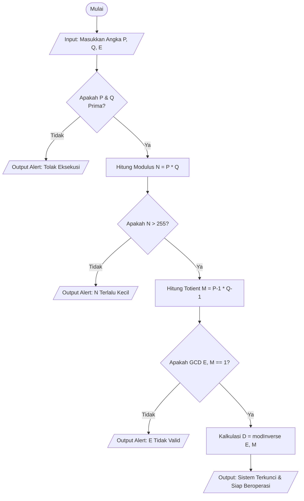
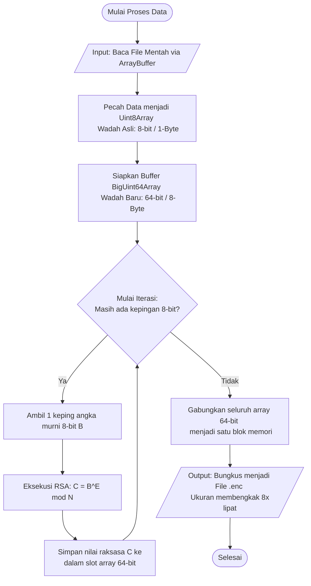
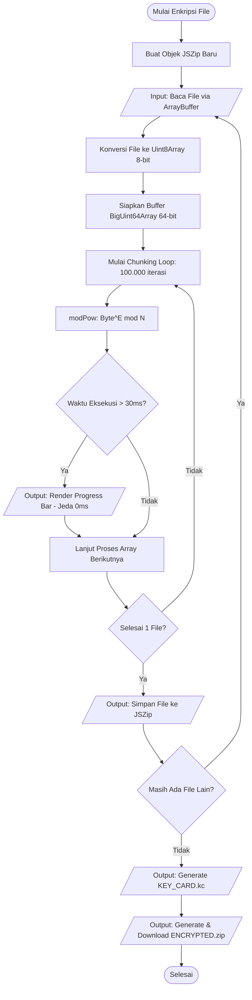
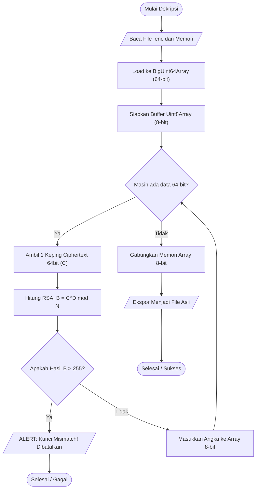
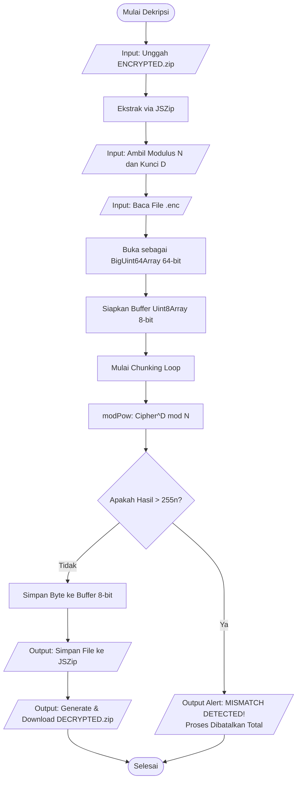

# SCHALE Vault - RSA Cryptography System 🛡️✨
**Project Code Name:** *Enkripsi file RSA*

**Version:** 2.0 (Modernized Web Architecture)

## Daftar Isi
* [1. Pendahuluan](#1-pendahuluan)
* [2. Arsitektur Teknis](#2-arsitektur-teknis)
* [3. Spesifikasi Inti Kriptografi (Matematika RSA)](#3-spesifikasi-inti-kriptografi-matematika-rsa)
* [4. Alur Kerja Sistem (System Workflow) 📊](#4-alur-kerja-sistem-system-workflow-)
  * [A. Workflow Penghasilan Kunci (Key Generation Pipeline)](#a-workflow-penghasilan-kunci-key-generation-pipeline)
  * [B1. Worklfow Fase Data Type Expansion 8 -> 64](#b1-worklfow-fase-data-type-expansion-8---64)
  * [B2. Workflow Enkripsi Data (Encryption Pipeline)](#b2-workflow-enkripsi-data-encryption-pipeline)
  * [C1. Workflow Worklfow Fase Data Type Reduction 64 -> 8 (original)](#c1-workflow-worklfow-fase-data-type-reduction-64---8-original)
  * [C2. Workflow Dekripsi & Sensor Integritas (Decryption Pipeline)](#c2-workflow-dekripsi--sensor-integritas-decryption-pipeline)
* [5. Mesin Pemrosesan Data (The Processing Engine)](#5-mesin-pemrosesan-data-the-processing-engine)
* [6. Sistem Integritas Data & Keamanan](#6-sistem-integritas-data--keamanan)
* [7. Integrasi Batch & ZIP](#7-integrasi-batch--zip)
* [8. Instruksi Penggunaan Offline Total (Air-Gapped Operation)](#8-instruksi-penggunaan-offline-total-air-gapped-operation)

---

## 1. Pendahuluan
**SCHALE Vault** adalah sistem kriptografi mandiri (*standalone*) berbasis web yang dirancang untuk melakukan enkripsi dan dekripsi file secara lokal (100% *Client-Side*). Aplikasi ini mengadaptasi estetika antarmuka dari *Blue Archive* (Arona & Plana) dan menggabungkannya dengan mesin pemrosesan data asinkron berkinerja tinggi.

Berbeda dengan implementasi RSA edukasi pada umumnya, SCHALE Vault dirancang dengan arsitektur **Batch Processing** dan **Non-blocking UI**, memungkinkannya memproses banyak file berukuran besar tanpa membuat peramban (browser) mengalami *freeze*.

---

## 2. Arsitektur Teknis

Aplikasi dibangun murni menggunakan standar web modern tanpa *framework* (Vanilla Stack) untuk memastikan ukuran file sekecil mungkin dan eksekusi secepat mungkin:
- **HTML5**: Struktur semantik dengan dukungan API File System (File Reader & Drag-and-Drop).
- **CSS3 (Modern)**: Menggunakan pendekatan *Glassmorphism*, *CSS Variables* untuk *Dynamic Theming* (Arona/Plana), dan *Shorthand properties* untuk kompresi ukuran file CSS.
- **JavaScript (ES6+)**: Menggunakan `BigInt` untuk komputasi kriptografi, `async/await` untuk operasi asinkron, dan `TypedArrays` (`Uint8Array`, `BigUint64Array`) untuk manipulasi memori mentah (*raw memory manipulation*).
- **JSZip (Library Eksternal)**: Digunakan khusus untuk mengompresi dan mengekstrak file *batch* dalam memori sebelum diunduh pengguna.

---

## 3. Spesifikasi Inti Kriptografi (Matematika RSA)

Aplikasi ini menggunakan implementasi RSA 64-bit yang direkayasa khusus untuk batas komputasi JavaScript sinkron.

### A. Modular Exponentiation (`modPow`)
Fungsi `modPow(b, e, m)` menghitung $b^e \pmod m$.
- **Algoritma**: *Right-to-Left Binary Exponentiation*.
- **Mekanisme**: Memecah pangkat $e$ menjadi representasi biner. Alih-alih mengalikan $b$ secara langsung (yang akan langsung menembus batas maksimal angka komputer dan menyebabkan *overflow*), algoritma ini menerapkan modulus $m$ pada setiap tahap perkalian berulang. Ini menjaga ukuran angka tetap kecil dan komputasi tetap cepat dalam hitungan $O(\log e)$.

### B. Kunci Privat / Modular Multiplicative Inverse (`modInverse`)
Fungsi `modInverse(e, m)` bertugas mencari kunci rahasia $D$.
- **Algoritma**: *Extended Euclidean Algorithm*.
- **Mekanisme**: Mencari koefisien Bézout sehingga persamaan $E \cdot D \equiv 1 \pmod{\phi(N)}$ terpenuhi. Ini menjamin bahwa data yang dipangkatkan dengan $E$ (Enkripsi) hanya bisa dikembalikan jika dipangkatkan dengan $D$ (Dekripsi).

### C. Validasi Prima (`isPrime`)
- Menggunakan *Trial Division* teroptimasi hingga $\sqrt{N}$. Untuk arsitektur 64-bit yang digunakan aplikasi ini, kompleksitas waktu maksimal adalah sekitar $O(2^{32})$, yang dieksekusi seketika oleh mesin V8 modern.

---

## 4. Alur Kerja Sistem (System Workflow) 📊

Di bawah ini adalah pemetaan mendetail mengenai bagaimana sistem bekerja di belakang layar.

### A. Workflow Penghasilan Kunci (Key Generation Pipeline)
Saat pengguna memasukkan angka $P, Q,$ dan $E$, sistem tidak langsung memprosesnya. Ada serangkaian validasi ketat sebelum kunci Modulus ($N$) dan Privat ($D$) diizinkan untuk digunakan.

### B1. Workflow Fase Data Type Expansion 8 -> 64
Menampung file mentah yang di upload kemudian di potong ke 8 bit yang akhirnya di enkripsi menjadi 64 bit

### B2. Workflow Enkripsi Data (Encryption Pipeline)
Ini adalah alur di mana file murni (Byte) dikonversi menjadi data terenkripsi 64-bit. Sistem ini menggunakan arsitektur *Asynchronous Chunking* untuk memastikan UI tidak *freeze*.

### C1. Workflow Worklfow Fase Data Type Reduction 64 -> 8 (original)
Pada fase ini file akan menyusut kembali ke ukuran normalnya (menyusut 8 kali lipat) dengan memindahkan angka raksasa 64-bit kembali ke asalnya yang berukuran 8-bit.

### C2. Workflow Dekripsi & Sensor Integritas (Decryption Pipeline)
Pada tahap ini, sistem membaca ZIP terenkripsi. Sebelum file disimpan, mesin matematika melakukan verifikasi integritas data (*Mismatch Check*) pada lapisan *bit-level*.

---

## 5. Mesin Pemrosesan Data (The Processing Engine)

Ini adalah bagian paling canggih dari SCHALE Vault yang membedakannya dari skrip RSA biasa.

### A. Memory Management (`TypedArrays`)
File tidak dibaca sebagai teks biasa, melainkan sebagai *byte stream* melalui `ArrayBuffer`.
- **Enkripsi**: Membaca file sebagai `Uint8Array` (8-bit per elemen, rentang 0-255). Data ini kemudian dikonversi menjadi `BigUint64Array` (64-bit) untuk menampung hasil enkripsi (karena $C = M^E \pmod N$ akan menghasilkan angka yang lebih besar dari 255).
- **Dekripsi**: Membaca file `.enc` sebagai blok memori 64-bit (`BigUint64Array`), mendekripsinya, lalu mengemasnya kembali menjadi byte standar (`Uint8Array`) siap pakai.

### B. Asynchronous Chunking (Non-blocking UI)
Mendekripsi file besar dengan `BigInt` adalah tugas yang sangat berat bagi CPU (*CPU-bound*). Jika dilakukan sekaligus, tab browser akan *crash* atau *freeze*.
- **Solusi**: Sistem membaca matriks memori dalam **Chunk** (potongan) sebesar **100.000 iterasi**.
- **Performance Break**: Setelah satu *chunk* selesai, program memeriksa waktu menggunakan `performance.now()`. Jika waktu eksekusi telah melebihi **30 milidetik**, program akan secara sengaja "tidur" selama 0 milidetik menggunakan `await new Promise(r => setTimeout(r, 0))`.
- **Dampak**: Operasi asinkron buatan ini melepaskan kendali kembali ke *Main Thread* browser. Ini mengizinkan browser untuk me-render animasi *Progress Bar* dan merespons interaksi pengguna, sehingga aplikasi terasa sangat mulus meskipun sedang melakukan miliaran kalkulasi matematis di balik layar.

---

## 6. Sistem Integritas Data & Keamanan

### A. Mismatch Integrity Sensor
Kesalahan paling fatal dalam RSA adalah mencoba mendekripsi data dengan Kunci Privat ($D$) atau Modulus ($N$) yang salah. Ini akan mengubah foto/dokumen menjadi barisan data korup yang hancur permanen.
- **Deteksi**: Setiap byte asli di dunia komputer memiliki nilai maksimum **255** (8-bit).
- **Mekanisme Sensor**: Saat mendekripsi blok 64-bit, sistem secara real-time mengevaluasi hasilnya. Jika perhitungan matematis mengembalikan nilai **lebih dari 255** (`dec > 255n`), itu adalah **bukti matematis absolut** bahwa kunci yang dimasukkan salah, atau file *ciphertext* telah dimodifikasi pihak luar.
- **Tindakan**: Operasi langsung digagalkan, *progress bar* direset, dan data pengguna diselamatkan dari korupsi.

### B. Key Card Protocol (`.kc`)
Untuk mencegah *human-error* saat mengetik ulang angka Modulus dan Privat key yang panjang:
- Saat enkripsi sukses, sistem menghasilkan manifestasi kunci berupa file teks `KEY_CARD.kc` yang ikut dibungkus ke dalam ZIP.
- Struktur `.kc` menggunakan pola *Regex* ketat yang secara otomatis di-*parsing* oleh fungsi `parseKC()` saat di-drag-and-drop oleh pengguna ke sesi dekripsi.

---

## 7. Integrasi Batch & ZIP

Aplikasi dirancang untuk produktivitas.
- **Virtual File System**: Menggunakan `JSZip`, file hasil pemrosesan (puluhan hingga ratusan file) tidak langsung memicu fitur *download* satu-per-satu (yang sering diblokir oleh sistem anti-spam browser).
- **Archiving**: Semua file `.enc` atau file terdekripsi ditampung di memori RAM (*Blob*), dibungkus rapi menjadi satu paket arsip tunggal dengan ID unik (contoh: `ENCRYPTED_A1B2C3.zip`).
- **Memory Cleanup**: Menggunakan `URL.revokeObjectURL()` setelah 60 detik untuk membersihkan memori RAM yang digunakan oleh blob ZIP raksasa, mencegah *memory leak* pada browser.

---

## 8. Instruksi Penggunaan Offline Total (Air-Gapped Operation)

Karena aplikasi memproses data murni di RAM tanpa mengirimkan paket apapun ke luar, aplikasi ini ideal untuk pengamanan data di komputer *air-gapped* (terputus dari internet).

Langkah instalasi:
1. Akses repository utama aplikasi.
2. Unduh file `jszip.min.js` dari CDN resmi.
3. Tempatkan `jszip.min.js`, `index.html`, `script.js`, `style.css` dan seluruh aset `.png` ke dalam satu folder lokal.
4. Buka `index.html` menggunakan browser apapun (Chrome, Firefox, Edge).
5. Aplikasi siap beroperasi dalam isolasi jaringan yang mutlak.

---
